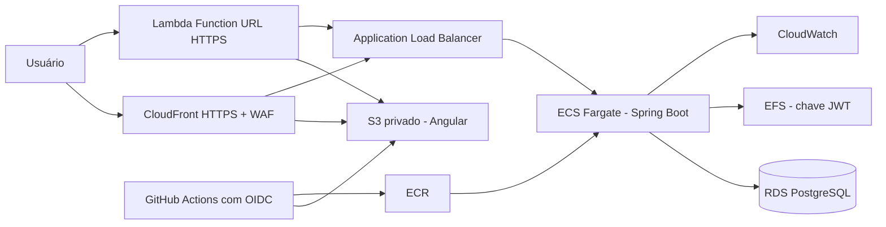

# Desafio Votação

Solução para gerenciamento de pautas e sessões de votação.

O repositório contém dois projetos independentes:

- [desafio-votacao-service](desafio-votacao-service/README.md): API Java 21 com Spring Boot, PostgreSQL e arquitetura hexagonal.
- [desafio-votacao-web](desafio-votacao-web/README.md): interface Angular 22 com Angular Material.

O enunciado recebido está preservado em [README-original.md](README-original.md).

## Execução com Docker

Inicie o backend:

```powershell
cd desafio-votacao-service
docker compose up --build -d --wait
```

Em outro terminal, inicie o frontend:

```powershell
cd desafio-votacao-web
docker compose up --build -d
```

Acesse:

- Frontend: http://localhost:4200
- Swagger: http://localhost:8080/swagger-ui.html
- Health check: http://localhost:8080/actuator/health

No primeiro acesso, escolha **Criar conta**. O cadastro exige nome, CPF com dígitos verificadores válidos e senha com pelo menos 10 caracteres.

Para encerrar os containers sem apagar os dados:

```powershell
docker compose down
```

Consulte o README de cada projeto para instalação, configuração, testes e execução sem Docker.

## Implantação na AWS

A opção AWS utiliza serviços gerenciados e mantém os projetos independentes:



A AWS oferece uma rota direta do Docker local para containers gerenciados, banco PostgreSQL privado, CDN e observabilidade sem exigir um cluster Kubernetes para uma única API. Os manifests Terraform ficam dentro de cada projeto:

1. Execute `desafio-votacao-service/infra/aws/deploy.ps1` para criar e publicar o backend.
2. Copie os outputs `api_origin_domain` e `origin_token`; o segundo é sensível e autentica o proxy no ALB.
3. Execute `desafio-votacao-web/infra/aws/deploy.ps1 -ApiOriginDomain "DOMINIO_DO_ALB" -OriginToken "TOKEN_DO_ORIGIN"`.
4. Use o output `application_url` como endereço público HTTPS.
5. Atualize `public_base_url` do backend com a URL pública antes da apresentação do fluxo mobile.

O modo padrão usa CloudFront e WAF. Contas novas que ainda aguardam a liberação do CloudFront podem acrescentar `-HostingMode lambda_url`; nesse modo, uma Lambda Function URL entrega o mesmo bucket privado e encaminha a API pelo token do origin.

A infraestrutura gera custos enquanto estiver ativa. Os READMEs dos projetos detalham variáveis, CI/CD, limitações do ambiente de demonstração e remoção dos recursos.

## Estrutura

```text
desafio-votacao/
├── desafio-votacao-service/
├── desafio-votacao-web/
├── README-original.md
├── README.md
└── LICENSE
```

O backend e o frontend podem ser distribuídos como repositórios separados. Cada pasta possui dependências, Dockerfile, Compose, workflow de CI, licença e instruções próprias.
