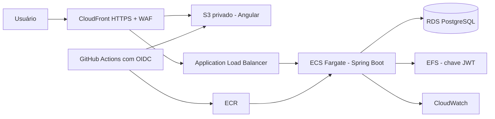

# Desafio Votação

Solução para gerenciamento de pautas e sessões de votação.

O repositório contém dois projetos independentes:

- [desafio-votacao-service](desafio-votacao-service/README.md): API Java 21 com Spring Boot, PostgreSQL e arquitetura hexagonal.
- [desafio-votacao-web](desafio-votacao-web/README.md): interface Angular 22 com Angular Material.

O enunciado recebido está preservado em [README-original.md](README-original.md).

## Execução com Docker

Inicie o backend:

```powershell
cd desafio-votacao-service
docker compose up --build -d --wait
```

Em outro terminal, inicie o frontend:

```powershell
cd desafio-votacao-web
docker compose up --build -d
```

Acesse:

- Frontend: http://localhost:4200
- Swagger: http://localhost:8080/swagger-ui.html
- Health check: http://localhost:8080/actuator/health

No primeiro acesso, escolha **Criar conta**. O cadastro exige nome, CPF com dígitos verificadores válidos e senha com pelo menos 10 caracteres.

Para encerrar os containers sem apagar os dados:

```powershell
docker compose down
```

Consulte o README de cada projeto para instalação, configuração, testes e execução sem Docker.

## Implantação de demonstração no Render

Os projetos possuem Blueprints separados para publicar a aplicação com planos Free:

1. Publique as alterações no repositório Git.
2. No [Render Dashboard](https://dashboard.render.com), conecte o repositório e crie um Blueprint com o caminho `desafio-votacao-service/infra/render/render.yaml`.
3. Aguarde o backend e o PostgreSQL ficarem disponíveis. Abra `/actuator/health/readiness` na URL pública da API e confirme a resposta `UP`.
4. Crie outro Blueprint com o caminho `desafio-votacao-web/infra/render/render.yaml`. Ele obtém automaticamente o hostname público do backend existente.
5. Abra a URL HTTPS do serviço `desafio-votacao-web` e realize cadastro, login, criação de pauta, abertura de sessão, voto e consulta do resultado.

O frontend é servido por Nginx e encaminha `/api` para a API por HTTPS. O navegador utiliza uma única origem para os cookies e as chamadas da aplicação. O PostgreSQL aceita conexões somente pela rede interna do Render. Os arquivos estão configurados para este monorepositório; ao publicar cada pasta em um repositório próprio, altere `rootDir` para `.` no respectivo Blueprint.

O plano Free é temporário: os serviços entram em repouso após 15 minutos sem acesso e podem levar cerca de um minuto para voltar; os dois serviços compartilham 750 horas gratuitas por mês. O PostgreSQL gratuito expira em 30 dias e não possui backups. Antes da avaliação, abra a API e o frontend e aguarde ambos estarem prontos. Consulte os [limites oficiais do Render](https://render.com/docs/free).

## Implantação na AWS

A opção AWS utiliza serviços gerenciados e mantém os projetos independentes:



A AWS oferece uma rota direta do Docker local para containers gerenciados, banco PostgreSQL privado, CDN e observabilidade sem exigir um cluster Kubernetes para uma única API. Os manifests Terraform ficam dentro de cada projeto:

1. Execute `desafio-votacao-service/infra/aws/deploy.ps1` para criar e publicar o backend.
2. Copie o output `api_origin_domain`.
3. Execute `desafio-votacao-web/infra/aws/deploy.ps1 -ApiOriginDomain "DOMINIO_DO_ALB"`.
4. Use o output `application_url` como endereço público HTTPS.
5. Atualize `public_base_url` do backend com a URL do CloudFront antes da apresentação do fluxo mobile.

A infraestrutura gera custos enquanto estiver ativa. Os READMEs dos projetos detalham variáveis, CI/CD, limitações do ambiente de demonstração e remoção dos recursos.

## Estrutura

```text
desafio-votacao/
├── desafio-votacao-service/
├── desafio-votacao-web/
├── README-original.md
├── README.md
└── LICENSE
```

O backend e o frontend podem ser distribuídos como repositórios separados. Cada pasta possui dependências, Dockerfile, Compose, workflow de CI, licença e instruções próprias.
